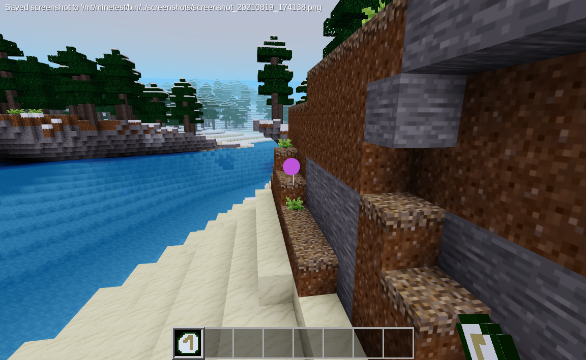
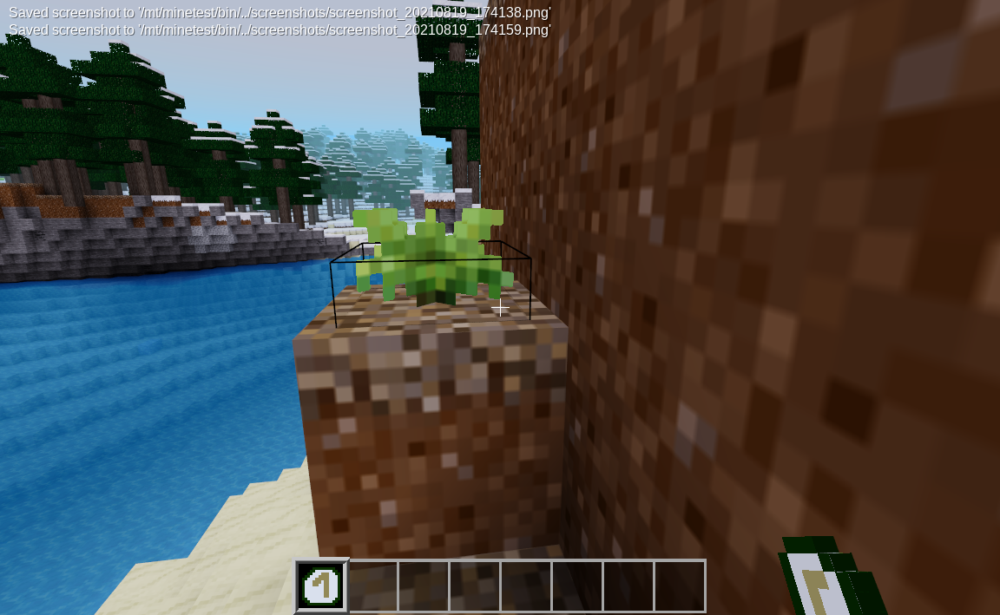

Blink Teleport mod for Minetest
======================

Dependencies
------------
Minetest 5.0.0+

Description
-------------

Blink is a short distance teleport with a cooldown period. The further you blink, the longer the cooldown. You can also place a temporary marker that will display your destination if you were to blink. This will add a new dynamic to PvP and/or survival servers.

Features
-------------

* By default you cannot blink into or out of protected areas (configurable)
* Ability to specify a protection owner to allow blinking (Useful for public areas)
* Height check disallows blinking into a space too short for the player
* If you blink into a player or mob, you will move directly behind them and face their back
-   currently compatible with all of Mobs Redo, NSSM, Creeper, and DMobs
* Swoosh sound included (7 sounds played randomly)
* Default max blink distance is 20 nodes (configurable)
* Able to set static cooldown and/or dynamic cooldown (0.1s for each block travelled + the static cooldown)

Configuration
-------------

Open the tab `Settings -> All Settings -> Mods -> blink` to get a list of all
possible settings.

For server owners: Check `settingtypes.txt` and modify your `minetest.conf`
according to the wanted setting changes.

TODO
--------

* Add tool wear and repair
* Use place marker button twice in the same place to blink there
* Localize
* Maybe switch to first weapon in hotbar when blinking behind players or mobs
* Clean up and document code

License
-------

`May change in the future!`

Licensed under the GNU LGPL version 3 or later.
See LICENSE.txt and http://www.gnu.org/licenses/lgpl-3.txt
